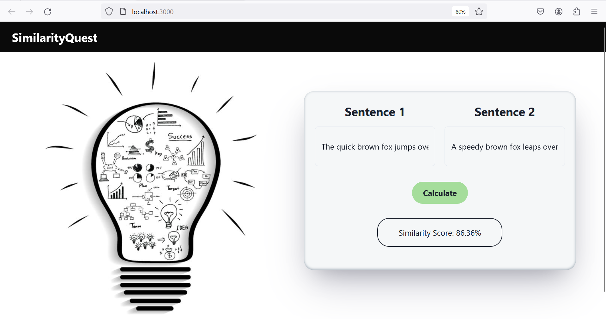

# SimilarityQuest: Sentence Similarity Checker

SimilifyScore is a web application built using React and a Hugging Face model to measure the similarity between two given sentences and display their similarity score.

## Features

- **Sentence Similarity Score:** Utilize Hugging Face's powerful language model to calculate the similarity score between two sentences.
- **User-Friendly Interface:** A clean and intuitive React-based UI for easy interaction with the sentence similarity checker.
- **Quick Testing:** Use the provided sentences or input your own to instantly see the similarity score.
- **Responsive Design:** Accessible and responsive design for a seamless user experience across various devices.

## How to Use

1. Clone the repository: `git clone https://github.com/your-username/similifyscore.git`
2. Navigate to the project directory: `cd similifyscore`
3. Install dependencies: `npm install`
4. Start the development server: `npm start`
5. Open your browser and visit `http://localhost:3000` to use the application.

## Screenshot

